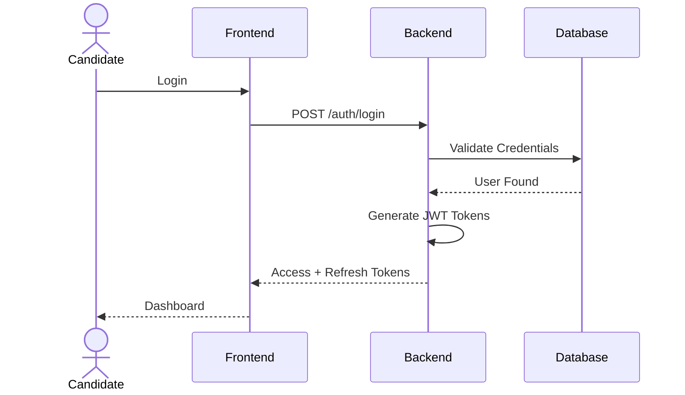
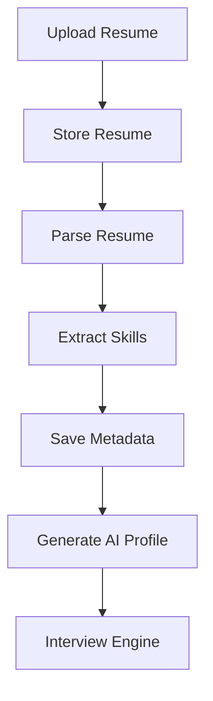
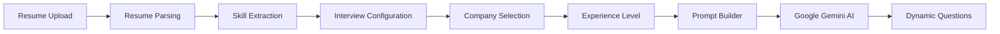
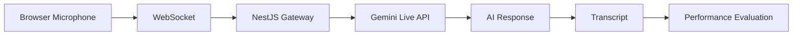
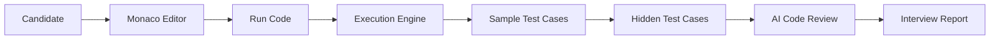
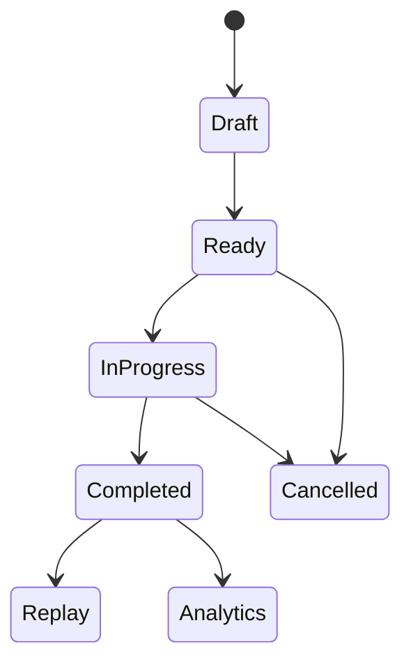
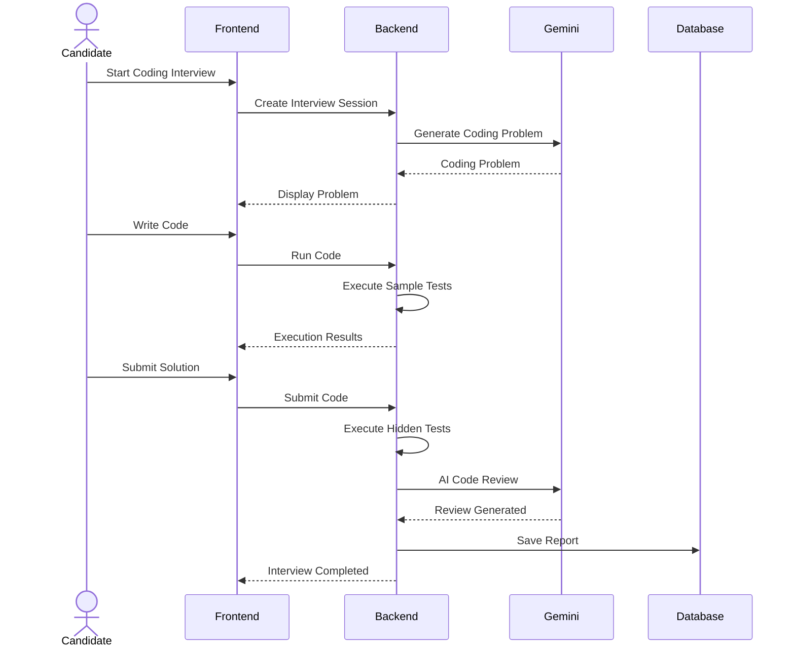
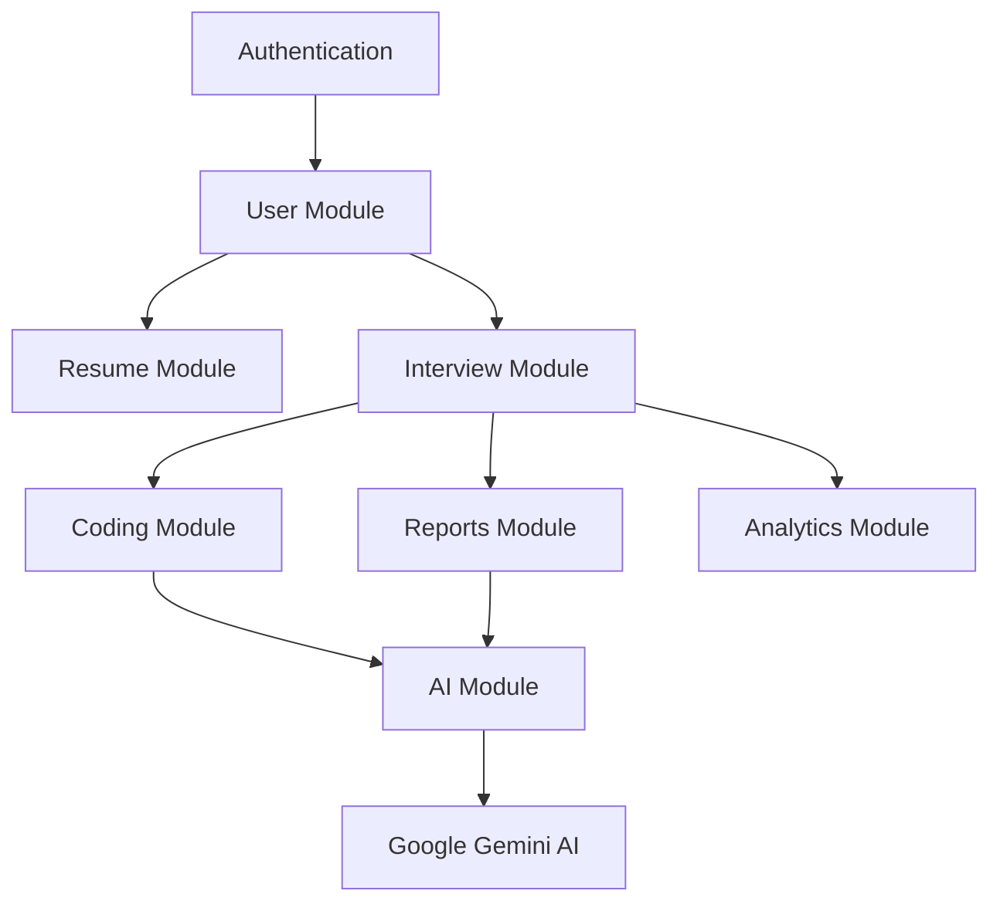

<div align="center">

# 🚀 AI Interview Platform

### Enterprise-Grade AI Powered Mock Interview & Coding Assessment Platform


[](https://nextjs.org/)
[](https://nestjs.com/)
[](https://www.typescriptlang.org/)
[](https://www.postgresql.org/)
[](https://www.prisma.io/)
[](https://redis.io/)
[](https://ai.google.dev/)
[](https://microsoft.github.io/monaco-editor/)
[](https://www.docker.com/)
[]()

---

### 🧠 AI-Powered • 🎤 Voice Interviews • 💻 Coding Interviews • 📄 Resume Intelligence • 📊 Analytics

</div>
---

# 📖 Table of Contents

- Project Overview
- Motivation
- Core Features
- Key Highlights
- Technology Stack
- System Architecture
- Monorepo Structure
- High-Level Request Flow
- Feature Showcase
- Screenshots

---

# 🌟 Project Overview

The **AI Interview Platform** is a production-grade full-stack application that simulates real-world software engineering interviews using **Google Gemini AI**.

Unlike traditional interview preparation websites that rely on predefined question banks, this platform dynamically generates personalized interview experiences based on a candidate's:

- Resume
- Skills
- Experience Level
- Target Company
- Interview Type
- Interview Duration
- Preferred Programming Language

The platform evaluates every interview in real time and automatically generates an extensive AI feedback report highlighting technical knowledge, communication quality, coding ability, confidence, vocabulary diversity, and personalized learning recommendations.

The project has been designed following modern SaaS architecture principles using a scalable Turborepo monorepo, modular NestJS backend, Next.js frontend, PostgreSQL database, Redis caching, and Google Gemini AI services.

---

# 📸 Application Showcase

---

## 🏠 Landing Page

Modern responsive landing page introducing the platform.

<p align="center">
  
</p>

---

## 🔐 Authentication

Secure JWT authentication with login and registration.

<table align="center">
<tr>
<td align="center">

### Login


</td>

<td align="center">

### Register


</td>
</tr>
</table>

---

## 📊 Dashboard

Centralized dashboard for interview management.

<p align="center">

</p>

### Dashboard Features

<table align="center">
<tr>

<td>


</td>

<td>


</td>

</tr>
</table>

---

## 🏢 Company Specific Interview Configuration

Choose company, experience level, interview mode and target role.

<table align="center">

<tr>

<td>


</td>

<td>


</td>

<td>


</td>

</tr>

<tr>

<td>


</td>

<td colspan="2">


</td>

</tr>

</table>

---

## 📄 Resume Upload

<p align="center">


</p>

---

## 🤖 AI Text Interview

<table align="center">

<tr>

<td>


</td>

<td>


</td>

</tr>

<tr>

<td>


</td>

<td>


</td>

</tr>

</table>

---

## 📑 AI Interview Report

<table align="center">

<tr>

<td>


</td>

<td>


</td>

</tr>

<tr>

<td>


</td>

<td>


</td>

</tr>

</table>
---

# 🎤 AI Voice Interview

Experience real-time AI-powered voice interviews using **Google Gemini Live API**. The platform conducts natural conversations, generates contextual follow-up questions, records transcripts, and evaluates communication skills.

<p align="center">
  
</p>

### Voice Interview Highlights

- 🎙️ Real-time AI conversation
- 🗣️ Speech-to-Text transcription
- 🤖 Gemini Live API Integration
- ⏱️ Speaking duration tracking
- 📄 Conversation transcript
- 📊 Communication evaluation

---

# 💻 Coding Interview Workspace

A professional coding environment inspired by **LeetCode**, **CodeSignal**, and **HackerRank**, powered by **Monaco Editor**.

<p align="center">
  
</p>

### Monaco IDE Features

<table align="center">
<tr>
<td align="center">

📝 Multi-language Support

</td>

<td align="center">

🎨 Dark / Light Themes

</td>

<td align="center">

⚡ Auto Completion

</td>
</tr>

<tr>
<td align="center">

▶️ Run Code

</td>

<td align="center">

✅ Submit Solution

</td>

<td align="center">

💾 Auto Save

</td>
</tr>

<tr>
<td align="center">

📋 Hidden Test Cases

</td>

<td align="center">

📊 Runtime Statistics

</td>

<td align="center">

🤖 AI Code Review

</td>
</tr>

</table>

### Execution Results

<p align="center">
  
</p>

---

# 📑 AI Performance Report

Every completed interview generates a comprehensive AI evaluation report with personalized coaching.

<table align="center">

<tr>

<td>


</td>

</tr>

</table>

### Report Includes

- 📊 Overall Interview Score
- 💬 Communication Analysis
- 🧠 Technical Knowledge Assessment
- 💻 Coding Performance Review
- 🎯 Strengths & Weaknesses
- 📚 Personalized Learning Recommendations
- 📈 Performance Metrics
- 🏆 Interview Summary

---

# 📈 Analytics Dashboard

Track your interview journey with interactive analytics and performance insights.

<p align="center">
  
</p>

### Analytics Features

- 📊 Interview Statistics
- 📈 Performance Trends
- 🏢 Company-wise Performance
- 💻 Coding Performance
- 🧠 Skill Growth Tracking
- 📅 Practice History
- 🏆 Best Performing Company
- 📉 Weakest Skill Analysis

---

# 🔄 Interview Replay

Replay every completed interview to understand your decision-making process and identify areas for improvement.

<table align="center">

<tr>

<td>


</td>

<td>


</td>

</tr>

<tr>

<td colspan="2" align="center">


</td>

</tr>

</table>

### Replay Features

- ⏱️ Interactive Timeline
- ❓ Question History
- 💬 Answer History
- 💻 Coding Submission Replay
- 📊 Evaluation Breakdown
- 🎯 AI Coaching Summary
- 📈 Performance Progression
- 📝 Resume Correlation

---
# 🎯 Motivation

Preparing for technical interviews usually requires a mentor or interviewer.

Most online interview platforms provide:

- Static question banks
- Generic coding problems
- No resume personalization
- Limited feedback
- No conversational AI

The AI Interview Platform was built to solve these problems by acting as an intelligent AI interviewer capable of conducting adaptive interviews similar to those used by leading technology companies.

---

# ✨ Core Features

## 👤 Authentication & User Management

- Secure JWT Authentication
- Refresh Token Rotation
- Password Encryption
- Protected Routes
- User Profiles
- Session Management

---

## 📄 Resume Intelligence

- Resume Upload
- Resume Parsing
- Resume Archive
- Resume Version History
- Resume Skill Extraction
- Resume Based Question Generation

---

## 🤖 AI Interview Engine

Supports

- Technical Interviews
- Behavioral Interviews
- HR Interviews
- Mixed Interviews

Interview Modes

- Text Interview
- Voice Interview
- Coding Interview

---

## 🏢 Company Specific Interviews

Candidates can simulate interviews for companies like

- Google
- Amazon
- Microsoft
- Adobe
- Atlassian
- Flipkart
- Uber
- Goldman Sachs
- Salesforce

Each company follows its own AI prompt strategy, evaluation rubric, and interview style.

---

## 💻 Professional Coding IDE

Integrated Monaco Editor featuring

- Syntax Highlighting
- Multiple Programming Languages
- Auto Completion
- Run Code
- Submit Solution
- Auto Save
- Theme Switching
- Console Output
- Runtime Statistics
- Hidden Test Cases
- AI Code Review

Supported Languages

- Java
- Python
- JavaScript
- C++
- C

---

## 🎤 AI Voice Interviews

- Real-Time Voice Conversations
- Speech Recognition
- Gemini Live API
- AI Generated Responses
- Voice Transcript
- Communication Evaluation

---

## 📊 AI Performance Reports

Automatic evaluation including

- Technical Score
- Communication Score
- Confidence
- Vocabulary
- Coding Accuracy
- Overall Performance
- AI Coaching Recommendations

---

## 📈 Analytics Dashboard

Visual analytics including

- Interview History
- Performance Trends
- Skill Distribution
- Coding Statistics
- Company Wise Performance
- Practice Frequency

---

## 🔄 Interview Replay

Replay every completed interview with

- Timeline View
- Question History
- Answer History
- Coding Attempts
- AI Feedback
- Report Summary

---

# ⭐ Key Highlights

✔ Enterprise Monorepo Architecture

✔ AI Powered Interview Generation

✔ Resume Aware Interview Personalization

✔ Professional Monaco Coding Workspace

✔ Voice Interview Engine

✔ Coding Evaluation Engine

✔ Interactive Analytics Dashboard

✔ Company Specific Interview Simulation

✔ AI Performance Reports

✔ Replay Previous Interviews

✔ Production Ready Backend Architecture

✔ Modular NestJS Services

✔ Modern Next.js App Router

---

# 🛠 Technology Stack

| Layer | Technologies |
|----------|----------------|
| Frontend | Next.js 15, React 19, TypeScript, Tailwind CSS, Shadcn UI, Zustand |
| Backend | NestJS 11, Express, WebSockets, BullMQ |
| Database | PostgreSQL, Prisma ORM |
| AI Services | Google Gemini Flash, Gemini Live API |
| Code Editor | Monaco Editor |
| Authentication | JWT, Refresh Tokens |
| Caching | Redis |
| Monorepo | Turborepo, PNPM |
| Containerization | Docker, Docker Compose |
| Deployment | Railway, Vercel |

---

# 🏗 Complete System Architecture

```text
                                    Candidate
                                         │
                                         │
                                         ▼
                    ┌──────────────────────────────────────────┐
                    │              Next.js Frontend            │
                    │                                          │
                    │  Authentication                          │
                    │  Dashboard                               │
                    │  Interview Wizard                        │
                    │  Monaco IDE                              │
                    │  Reports                                 │
                    │  Analytics                               │
                    └──────────────────┬───────────────────────┘
                                       │
                         REST APIs / WebSockets
                                       │
                                       ▼
                    ┌──────────────────────────────────────────┐
                    │              NestJS Backend              │
                    │                                          │
                    │  Auth Module                             │
                    │  Resume Module                           │
                    │  Interview Module                        │
                    │  Coding Engine                           │
                    │  AI Module                               │
                    │  Analytics Module                        │
                    │  Reports Module                          │
                    └───────────────┬───────────────┬──────────┘
                                    │               │
                                    │               │
                                    ▼               ▼
                            PostgreSQL          Redis Cache
                                    │
                                    ▼
                              Prisma ORM
                                    │
                                    ▼
                          Google Gemini AI
                    ┌──────────────────────────┐
                    │                          │
                    │ Question Generation      │
                    │ Voice Conversations      │
                    │ Coding Review            │
                    │ Report Generation        │
                    │ Resume Intelligence      │
                    └──────────────────────────┘
```

---

# 📂 Monorepo Structure

```text
AI-INTERVIEW-PLATFORM
│
├── apps
│   │
│   ├── api
│   │   ├── auth
│   │   ├── analytics
│   │   ├── interview
│   │   ├── coding
│   │   ├── reports
│   │   ├── websocket
│   │   ├── resume
│   │   └── ai
│   │
│   └── web
│       ├── dashboard
│       ├── interviews
│       ├── reports
│       ├── analytics
│       ├── replay
│       ├── auth
│       └── components
│
├── packages
│   ├── db
│   ├── ui
│   ├── shared
│   └── config
│
├── docker-compose.yml
├── turbo.json
├── pnpm-workspace.yaml
└── package.json
```

---

# 🔄 High-Level Request Flow

```text
User
 │
 ▼
Login
 │
 ▼
Upload Resume
 │
 ▼
AI extracts Skills
 │
 ▼
Create Interview
 │
 ▼
Gemini Generates Questions
 │
 ▼
Candidate Answers
 │
 ▼
AI Evaluates Performance
 │
 ▼
Interview Report
 │
 ▼
Replay + Analytics Dashboard
```

---
# 🏗 Backend Architecture

The backend is built using **NestJS 11** following a modular, domain-driven architecture.

Each module encapsulates its own business logic, controllers, services, DTOs, validation rules, and database interactions, making the application scalable, maintainable, and easy to extend.

```text
apps/api
│
├── auth
├── users
├── resume
├── interview
├── analytics
├── code-executor
├── websocket
├── ai
├── reports
├── common
├── config
└── prisma
```

---

## Backend Modules

### 🔐 Authentication Module

Responsible for authentication and authorization.

**Responsibilities**

- User Registration
- User Login
- JWT Authentication
- Refresh Token Rotation
- Password Hashing
- Route Protection
- Session Management

**Technologies**

- JWT
- Passport.js
- Bcrypt

---

### 👤 User Module

Responsible for user profile management.

**Features**

- User Profiles
- Profile Updates
- Resume Ownership
- Interview Ownership

---

### 📄 Resume Module

Handles intelligent resume management.

**Features**

- Resume Upload
- Resume Storage
- Resume Parsing
- Resume Versioning
- Skill Extraction

The extracted skills are used by the AI Interview Engine to generate personalized interview questions.

---

### 🎯 Interview Module

The Interview Module orchestrates the complete interview lifecycle.

**Responsibilities**

- Create Interview
- Configure Interview
- Resume Validation
- Company Selection
- Experience Selection
- Question Generation
- Interview Progress
- Interview Completion

---

### 💻 Coding Module

Responsible for coding interview execution.

**Features**

- Coding Question Generation
- Code Execution
- Hidden Test Cases
- AI Code Review
- Runtime Analysis
- Memory Usage Analysis

---

### 📊 Analytics Module

Generates detailed candidate insights.

**Features**

- Performance Trends
- Skill Analytics
- Coding Statistics
- Company-wise Reports
- Interview History

---

### 📑 Reports Module

Generates AI-powered evaluation reports.

Every completed interview produces:

- Technical Evaluation
- Communication Analysis
- Coding Review
- Overall Score
- Recommendations

---

### 🤖 AI Module

Acts as the abstraction layer between the application and Google Gemini.

**Responsibilities**

- Resume Intelligence
- Question Generation
- Coding Problem Generation
- AI Evaluation
- Prompt Engineering
- Conversation Context

---

# 🎨 Frontend Architecture

The frontend is built using **Next.js 15 App Router**.

```text
apps/web
│
├── app
├── dashboard
├── interviews
├── analytics
├── reports
├── replay
├── auth
└── components
```

Each feature owns its own:

- Components
- API Hooks
- Forms
- Validation
- State Management
- UI

This feature-first architecture keeps the application scalable and maintainable.

---

# 🔄 Authentication Flow



---

# 📄 Resume Intelligence Flow



---

# 🤖 AI Interview Generation Pipeline



---

# 🎤 Voice Interview Pipeline



---

# 💻 Coding Interview Pipeline



---

# 📑 AI Report Generation

Every interview automatically generates a comprehensive report including:

- Technical Knowledge
- Communication Skills
- Coding Ability
- Vocabulary Analysis
- Confidence Score
- Problem Solving
- Strengths
- Weaknesses
- Personalized Learning Recommendations

---

# 🔄 Complete Interview Lifecycle



---

# 🧠 Coding Interview Lifecycle



---

# 🧩 Module Interaction



---

# ⚡ Performance Optimizations

## Backend

- Stateless JWT Authentication
- Modular NestJS Services
- Prisma Query Optimization
- Redis Caching
- Lazy Loading
- Transactional Database Operations

## Frontend

- Next.js App Router
- React Server Components
- Dynamic Imports
- Image Optimization
- React Query Caching
- Local Draft Persistence

## AI Layer

- Prompt Reuse
- Structured JSON Responses
- Retry Strategy
- Timeout Handling
- Resume Context Caching

---

# 🔒 Security

Implemented security mechanisms include:

- JWT Authentication
- Refresh Tokens
- Password Hashing
- DTO Validation
- Request Validation
- Authorization Guards
- Ownership Validation
- SQL Injection Protection (Prisma)
- Input Sanitization
- Protected API Routes
- Environment Variable Isolation
