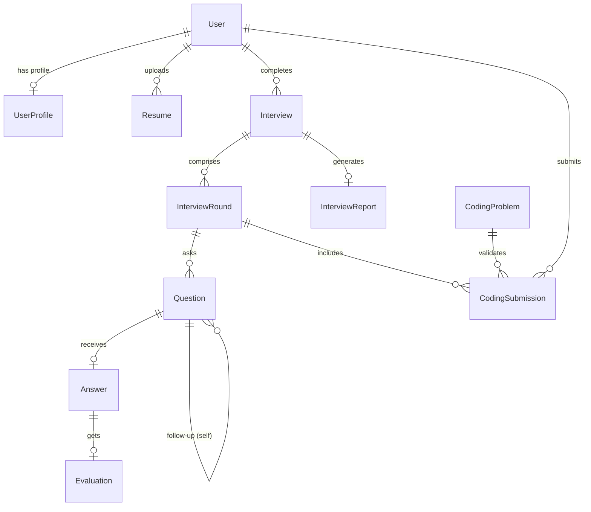

# Database Schema Documentation

This document describes the PostgreSQL and Prisma schema designed for the AI Interview Platform.

---

## 1. Entity Purposes
* **User:** Holds the core identity, email verification status, security password hashes, and system role (`CANDIDATE` or `ADMIN`).
* **UserProfile:** Stores candidate profile details (headline, biography, experience level, and target job roles).
* **Resume:** Stores resume metadata and reference keys for parsed raw text and structural metadata. No actual PDF/binary files are stored here.
* **Interview:** Represents a complete interview session config and current completion status.
* **InterviewRound:** Isolates distinct stages within an interview (e.g. Technical, Behavioral, Coding rounds).
* **Question:** Houses the exact questions presented to the candidate. Supports nested child relations for AI follow-up tracking.
* **Answer:** Connects candidate textual answers and audio transcripts to specific questions.
* **Evaluation:** Holds detailed structural evaluations and AI scores (Technical accuracy, completeness, and clarity rating) generated for candidate answers.
* **InterviewReport:** Synthesizes the final aggregate candidate performance audit and improvement recommendations.
* **CodingProblem:** Reusable coding problems containing starter code map structures and constraints.
* **CodingSubmission:** Tracks code solutions submitted by candidates against specific programming problems.

---

## 2. Major Relationships
* `User` (1) ── (0..1) `UserProfile` (Cascade delete on user deletion).
* `User` (1) ── (0..*) `Resume` (Cascade delete on user deletion).
* `User` (1) ── (0..*) `Interview` (Cascade delete on user deletion).
* `Interview` (1) ── (0..*) `InterviewRound` (Cascade delete on interview deletion).
* `Interview` (1) ── (0..1) `InterviewReport` (Cascade delete on interview deletion).
* `InterviewRound` (1) ── (0..*) `Question` (Cascade delete on round deletion).
* `InterviewRound` (1) ── (0..*) `CodingSubmission` (Cascade delete on round deletion).
* `Question` (1) ── (0..1) `Answer` (Cascade delete on question deletion).
* `Question` (0..1) ── (0..*) `Question` (Self-referencing parent-child follow-up question relationship. Cascade delete on parent question deletion).
* `Answer` (1) ── (0..1) `Evaluation` (Cascade delete on answer deletion).
* `CodingProblem` (1) ── (0..*) `CodingSubmission` (Restrict delete; coding problems cannot be deleted if submissions exist).

---

## 3. Important Constraints
* **Composite Uniqueness:**
  * `InterviewRound`: `@unique([interviewId, sequence])` enforces sequence ordering and prevents duplicate round steps.
  * `Question`: `@unique([interviewRoundId, sequence])` ensures question sequence counts remain collision-free.
* **1-to-1 Uniqueness:**
  * `UserProfile.userId` is `@unique`.
  * `InterviewReport.interviewId` is `@unique`.
  * `Answer.questionId` is `@unique`.
  * `Evaluation.answerId` is `@unique`.
  * `CodingProblem.slug` is `@unique`.

---

## 4. Indexing Strategy
* `User.email` — Automatically indexed via `@unique` for fast login credential queries.
* `Interview.userId`, `Interview.createdAt` — Composite index for fetching a user's interview history sorted by date.
* `Interview.status` — Index to filter sessions (e.g. find all active `IN_PROGRESS` interviews).
* `CodingSubmission.userId`, `CodingSubmission.submittedAt` — Composite index to fetch a candidate's code submission history sorted chronologically.

---

## 5. JSON Field Decisions
* **`Resume.structuredData`:** Stores variable extracted resume fields (skills, projects, education history) in JSON format to support unstructured document formats without schema alterations.
* **`CodingProblem.examples`:** Stores a list of inputs, outputs, and explanations for coding constraints.
* **`CodingProblem.starterCode`:** Key-value mapping of programming languages (e.g. `JAVASCRIPT`, `PYTHON`) to starter boilerplate code blocks.

---

## 6. Deletion Strategy
* **Cascade Deletes:** When a Candidate User deletes their account, all private information (Profile, Resumes, Interviews, and Submissions) is cascade-deleted.
* **Restricted Deletes:** System-administered resources (like `CodingProblem`) use `onDelete: Restrict` to prevent deletion if there are active candidates who have submitted code for them.

---

## 7. Data Retention & Privacy Considerations
* **PII Redaction:** User email, Profile full name, and raw Resume text contain sensitive Personal Identifiable Information (PII). In production, these fields must be filtered and must never appear in system logging tools.
* **Auditing:** Evaluator prompt versions (`evaluatorVersion`) are persisted inside `Evaluation` blocks to ensure historical grading scores remain reproducible even if LLM models change.

---

## 8. Entity-Relationship Diagram

